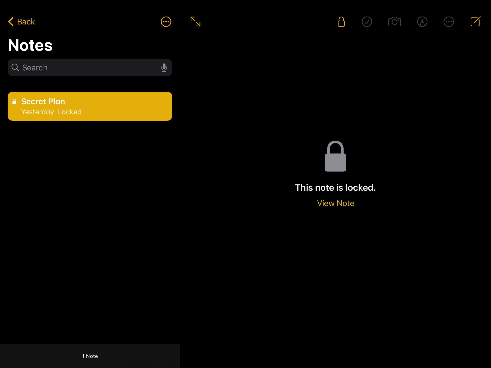

# forensics/Tablet 2 (197 points)
**Description :** *Wait... there are TWO impostors?! Red must have been in contact with the other impostor. See if you can find out what they are plotting.*

*NOTE: Both Tablet challenges use the same file, which can be downloaded from Tablet 1.*

**Given files :** *[
tablet.tar.gz](https://drive.google.com/file/d/1KcRzBZRA1VbuyzR6fVaibLgJQ11dD737/view?usp=sharing)*

## Write-up :

The download is an archive of a portion of the firmware of an iPadOS device. I knew that application data is stored at `/private/var/mobile/Containers/Data/Application`, so this is where I began my search.

I quickly stumbled across many `.ktx` files in the Library/ directory of every application. A quick google search revealed these are "screen snapshot" files that are taken every time the user switches applications. This really caught my eye:

> KTX files are most commonly used by forensic investigators, who examine users' KTX files for evidence of what a user was doing at specific times.

Perfect! So how do we open them? On a Mac, you can simply use Apple Preview, and on Windows, there is a handy tool named [ios_ktx2png.exe](https://github.com/ydkhatri/MacForensics/blob/master/IOS_KTX_TO_PNG/ios_ktx2png.exe) that works a treat.

Taking a look through all the snapshots, two really stand out:

Ok great, this matches with the description of the challenge (BlueAmogus being the second imposter), so we know we're on the right track, and the flag is almost certainly in that note. Let's try and get this password.

Running `grep -rlai discord .` in `/private/var/mobile/Containers/Data/Application` reveals that `0CE5D539-F72A-4C22-BADF-A02CE5A50D2E` is Discord's bundle. From here, we can run `grep -rla 'The password is ' .` which immediately gives us `Documents/mmkv/mmkv.default`. Opening this file, we can see lots of cached messages, including:

	"content":"The password is ||su5Syb@k4||"

Great, we've got our password! Now we just need to decrypt that note.

Another google search takes me to the [apple_cloud_notes_parser](https://github.com/threeplanetssoftware/apple_cloud_notes_parser) GitHub project. This wants the `NoteStore.sqlite` file from the device, which can be found at `/private/var/mobile/Containers/Shared/AppGroup/4DCEB2C7-5420-4446-9111-4091A929B4AC`.

We then create a text file with our password (`echo 'su5Syb@k4' > passwords.txt`) and we can decrypt the note:

	ruby notes_cloud_ripper.rb -f NoteStore.sqlite -w passwords.txt

In our `output/` directory we now find the file [output/html/all_notes_1.html](files/all_notes_1.html) which gives us our flag!

	uiuctf{wh3n_the_imp0stors_4re_su5_305da9}
